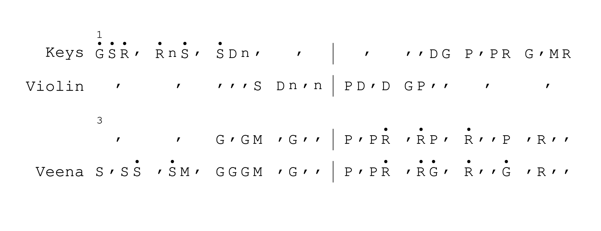

# Swara Scribe

**Swara Scribe** is a lightweight, CLI-based notation engine designed to render Indian Classical (Sargam) music scores from plain-text files.

## Background
**Swara Scribe** was born out of personal necessity. In the Indian Classical tradition, music is often transmitted aurally, with written scores often as an after thought. As such there lacks any unified notation and even less tools to render the notations. Poor musical memory alongside a stubborn reliance on scores made it difficult for me to enter this world, hence the need for a tool that provides a fast, keyboard-centric workflow to easily create orchestral sargam scores.

Many of its design decisions are as a result of keeping the scope to what I actually need to get by.

## Getting started
### Installation

You will need OCaml and opam.

```
opam install . --deps-only
dune build
```


### Usage

```
dune exec ./bin/main.exe example/test.txt
```

The rendered score `example/test.png` will be generated.


## Swara scribe syntax
* A **newline** indicates a new instrumental part for the same line.  
* **Two newlines** indicate a new line.  

Within a part:

* A part can optionally be prefixed with `[<INSTRUMENT>]` to indicate the instrument assigned to play that part.  
* **Whitespace** is used to demarcate matras as well as barlines.  
* `|` indicates a **barline**.  
* **Note**:
    * The number of matras across parts within a line should match

Within a matra:  

* **Notes** are of the form `S r R g G m M P d D n N`.  
    * Notes can be optionally suffixed with `'` for higher octave or `,` for lower octave.  
* `-` indicates **sustenance** of the previous note.  
* `.` indicates a **rest** (renders as `,`).
* **Note**: 
    * The engine calculates the **maximum space required** for each matra across all parts and **centers the notes** accordingly.

 
### Example
Raw swara scribe input: 
```
[Keys] G'S'R'. R'nS'. S'Dn. . | . ..DG P.PR G.MR
[Violin] . . ...S Dn.n | PD.D GP.. . .

. . G.GM .G.. | P.PR' .R'P. R'..P .R..
[Veena] S.SS' .S'M. GGGM .G.. | P.PR' .R'G'. R'..G' .R..
```

Rendered score:



## Future plans
* [ ] Ability to choose to only render one instrument part
    * [ ] Ability to mark important parts within each line, then when in 'single-instrument' mode there will be an option to display these important parts
    * [ ] Make the other parts or other important parts differentiated from the selected instrument part such as through highlighting, sizing (most complex) or coloring of text
* [ ] Lyrics for vocal
* [ ] Gamakas
* [ ] Option to set bar number for line (to allow skipping)
* [ ] Allow for text at the top of each matra and top left of each line
